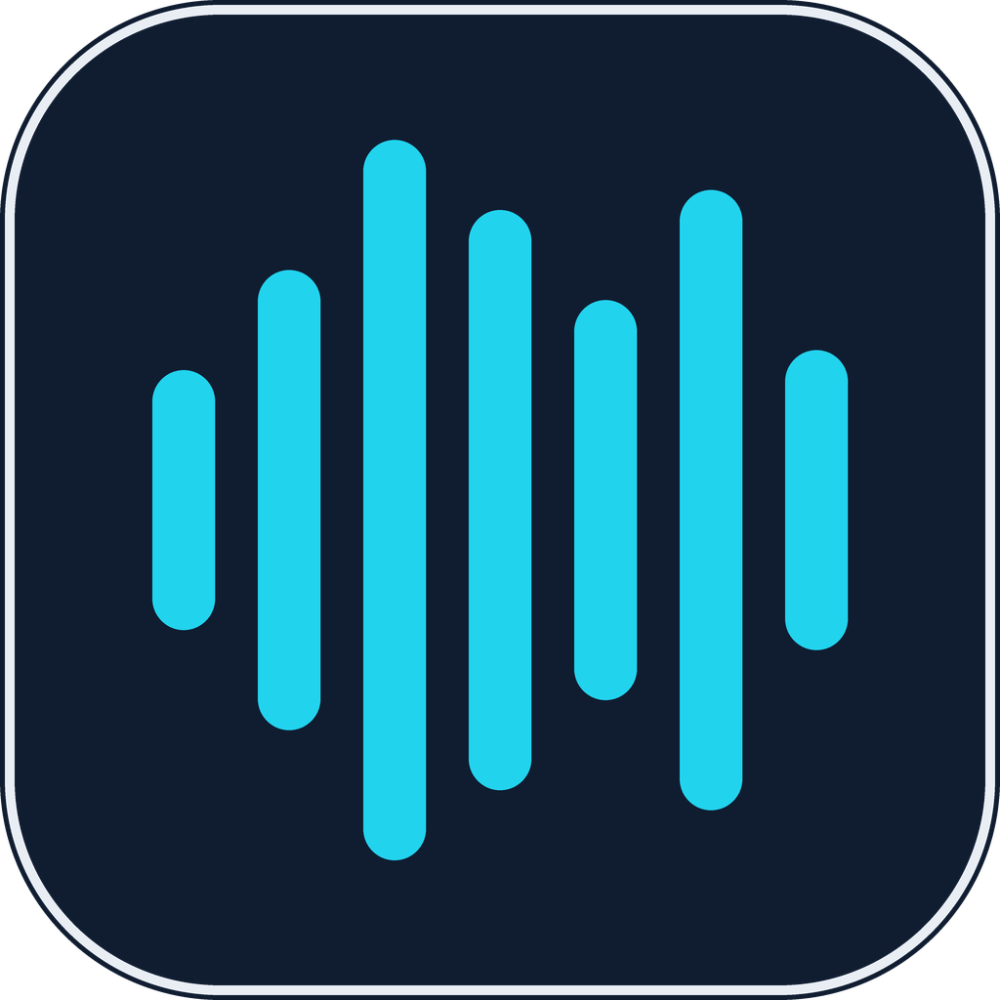
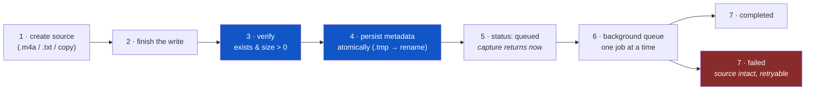
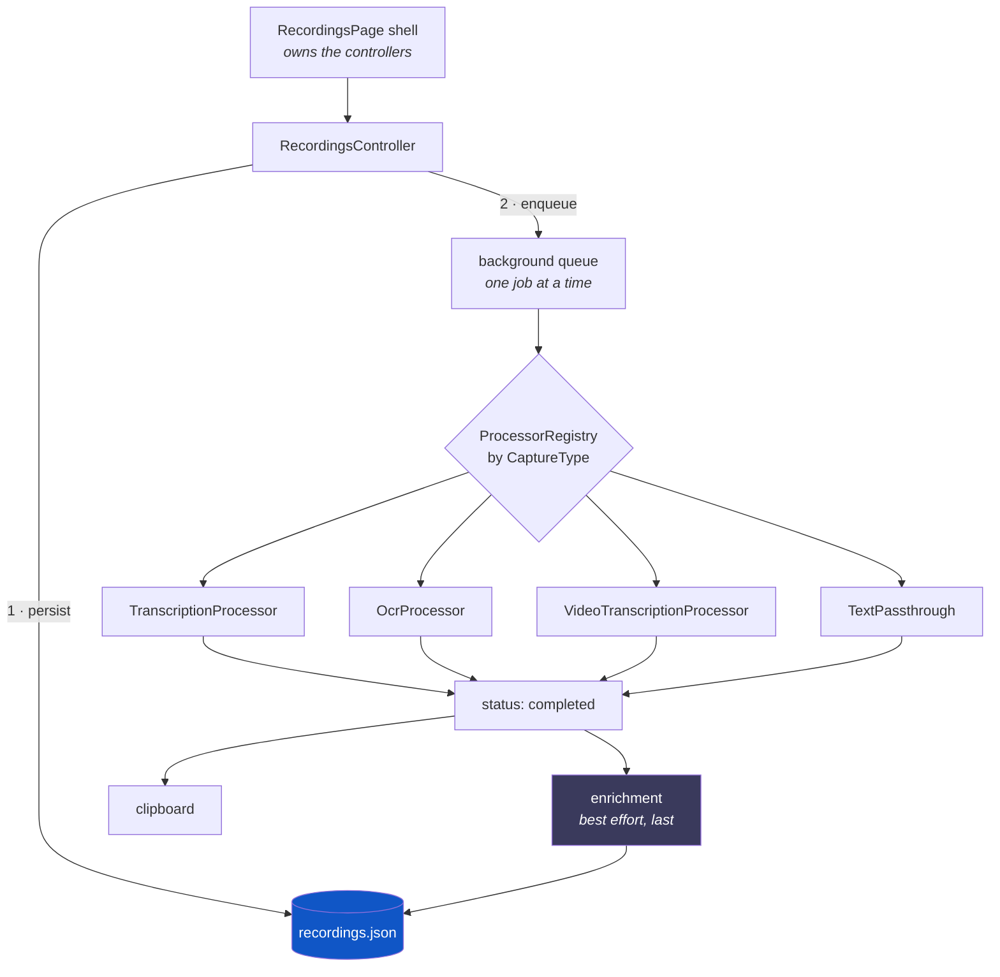

<div align="center">



# Augustyniak Capture

**Offline-first capture queue for voice, text, images and video.**
Your thought lands on disk *before* anything clever is attempted with it.

[](https://flutter.dev)
[](https://dart.dev)
[](#-build--deploy)
[](#-the-one-guarantee)
[](LICENSE)

[Quick start](#-quick-start) ·
[What it captures](#-what-it-captures) ·
[Build & deploy](#-build--deploy) ·
[Providers](#-connect-a-provider) ·
[Architecture](#-architecture)

</div>

---

## 💡 What is this?

Press a global hotkey, talk, forget about it. The recording is saved and verified
on disk immediately; transcription, OCR and AI titling happen **afterwards, in the
background, and are allowed to fail** without ever costing you the capture.

```
   press Ctrl+Alt+R   ->   file on disk, verified   ->   transcribed
   press Ctrl+Alt+N   ->   file on disk, verified   ->   passed through
   upload an image    ->   file on disk, verified   ->   OCR'd
   upload a video     ->   file on disk, verified   ->   audio track transcribed
                              ^                            ^
                              |                            |
                       never negotiable            may fail, retryable
```

Then the enrichment stage gives each capture a title, a summary, a category and
tags, and one keypress hands it off to your project's `inbox.md` — where the
coding agent that reads that repo next will find it.

---

## ⚡ Quick start

```bash
git clone <this-repo> && cd augustyniak-capture
flutter pub get
flutter run                       # pick a device when prompted
```

That is genuinely all — the app is fully usable with **no** API key. Recording,
notes, uploads, storage, search, projects and hand-off all work offline. Only
transcription, OCR and AI titling need an endpoint, and you add that in the UI.

<details>
<summary><b>If <code>flutter run</code> complains about the platform scaffolding</b></summary>

All six targets (`android/ ios/ linux/ macos/ windows/`) are checked in, but a
much newer Flutter SDK may want regenerated templates:

```bash
flutter create --platforms=android,ios,linux,macos,windows .
rm test/widget_test.dart     # ⚠️ see below
```

`flutter create` leaves `lib/` alone, but it **adds `test/widget_test.dart`** —
the counter-app template, which imports a `MyApp` this project does not have.
Leave it and both `flutter analyze` and `flutter test` fail on a file nobody
wrote. It also rewrites `.metadata` to list only the platforms you named;
restore the other entries by hand if you regenerate a single platform.

</details>

---

## 🔒 The one guarantee

Every capture path — microphone, text note, audio/image/video upload — runs the
**same seven steps in the same order**. This ordering is the reason the app
exists.



Two rules fall out of it, and both are enforced in code:

| Rule | Why it matters |
| --- | --- |
| **A processor only ever reads the source file** | It never writes, moves or deletes it. A failed transcription costs you a status, never a recording. |
| **A bad read of the index can never overwrite it** | `recordings.json` is rewritten whole on every change, so an unreadable index freezes *all* writes for the session and says so on screen, instead of quietly writing emptiness over your history. |

Capture never waits on processing. Start a new recording while the previous one
is still being transcribed — the queue simply grows.

---

## 📥 What it captures

| | Type | Stored as | Processing | Where it works |
| --- | --- | --- | --- | --- |
| 🎙 | microphone recording | `.m4a` | transcription | everywhere |
| 📝 | text note | `.txt` | passthrough, no network | everywhere |
| 🎧 | audio upload | original ext | transcription | everywhere |
| 🖼 | image | `.jpg` / `.png` | **OCR** — vision model, or `tesseract` | everywhere with a vision profile; desktop otherwise |
| 🎬 | video | `.mp4` / `.mov` | `ffmpeg` audio track → transcription | desktop |

Image OCR is **LLM-first**: with an enrichment profile configured it sends the
image to that profile's vision endpoint on *every* platform, mobile included.
Without one, it falls back to system `tesseract` on desktop.

```bash
# optional desktop binaries — OCR fallback and all video handling
sudo apt-get install tesseract-ocr tesseract-ocr-pol ffmpeg   # Debian/Ubuntu
brew install tesseract tesseract-lang ffmpeg                  # macOS
winget install Gyan.FFmpeg UB-Mannheim.TesseractOCR           # Windows
```

Missing a binary is not a crash: the item is still ingested, verified and listed,
its processing lands `failed` with a readable error and a retry button, and the
source file is untouched.

---

## 🖥 The five tabs

| Tab | What it is for |
| --- | --- |
| **Queue** | every capture, review progress, search, filters, playback, inline editing |
| **Projects** | repository contexts, active project, one-click coding-agent sessions |
| **Models** | provider profiles — transcription and enrichment, add / edit / activate |
| **Logs** | live pipeline events (persist, queue, transcribe, errors) with a level filter |
| **Config** | appearance, audio parameters, global shortcuts, enrichment profile, keyring status |

### A queue row, annotated

```
┌────────────────────────────────────────────────────────────────┐
│ [#]  Sprint planning notes                    play  edit  done │  (1)
│      meetingNote    backend-api                                │  (2)
│      We agreed to postpone the migration until the index       │  (3)
│      durability work lands, and to split the router...         │
│      file verified · 6.8 MB · persisted                        │  (4)
└────────────────────────────────────────────────────────────────┘

 (1)  Type icon — replaced by the extracted video poster in the identical
      geometry, so a row's shape never depends on whether a frame was pulled.
      The title comes from enrichment; with no profile it reads "Recording ·
      14:32" — never the filename, because a column of uuids is unscannable.
 (2)  Category and project. Both are *labels*, so both render outlined;
      only the pipeline status ever gets a filled pill.
 (3)  The processor's output — transcript, OCR result, or the note body.
      This is what Queue search matches on.
 (4)  Measured by the very check that proved the file was non-empty at capture
      time. It is never an estimate; captures saved before it was recorded
      simply omit the segment rather than printing "0 B".
```

The action strip is **play / edit / done** — all cheap and reversible. `DELETE`
lives one level deeper, inside the editor, behind a dialog that names the item:
queue rows all look alike, and a destructive control a few pixels from `play` is
the one mis-tap this app cannot undo.

### Filters

Five status chips that **partition** the list, each with a live count:

| Chip | Holds |
| --- | --- |
| `ALL` | everything — the union of the four below |
| `QUEUE` | queued, plus the one currently running |
| `READY` | processing finished |
| `FAILED` | processing failed; source intact, retry offered |
| `RAW` | persisted and verified, not yet handed to a processor |

…intersected with a second, independent axis: `DESK` / `OFF DESK` / `ANY`. That
one is about *you*, not the pipeline — nothing in processing ever sets or clears
it. Counts describe the queue, not the search box.

### Keyboard

The Queue is fully drivable without the mouse. Letters carry no modifier — a
focused text field eats them first, so `e` types an "e" in search and edits a row
everywhere else.

| Key | Action | | Key | Action |
| --- | --- | --- | --- | --- |
| `↑` `↓` / `J` `K` | move selection | | `R` | route / hand off |
| `E` | edit inline | | `Space` | play |
| `D` | mark done | | `Ctrl/⌘+F`, `/` | search |
| `Esc` | clear selection | | | |

### Three layouts, one shell

```
   under 600 px          600 - 900 px            900 px and up
 ┌────────────┐      ┌────────────────┐      ┌──────┬────────────────┐
 │   rows     │      │     cards      │      │ rail │     cards      │
 │ [========] │      │ [============] │      │ logo │ [============] │
 │ [========] │      │ [============] │      │ nav  │ [============] │
 │            │      │        (o)dock │      │ (o)  │                │
 ├────────────┤      ├────────────────┤      └──────┴────────────────┘
 │ nav  (o)   │      │      nav       │
 └────────────┘      └────────────────┘
  nav bar carries     nav bar plus a       a 216 px column carries
  the capture         floating capture     navigation AND capture,
  buttons inline      dock                 so neither bar is drawn
```

Chosen from a `LayoutBuilder`, not `MediaQuery`, so dragging a desktop window
narrow really does fall back through all three.

---

## 🔌 Connect a provider

No code change and no rebuild: open **Models → + profile**, pick a preset, paste
a key. Presets ship for:

| Transcription | Enrichment / vision |
| --- | --- |
| OpenAI transcribe · OpenAI Whisper | OpenAI · Anthropic |
| Groq | Groq chat *(no vision model — images will fail)* |
| Local whisper.cpp (`localhost:8080`) | Local Ollama (`localhost:11434`) |
| Custom endpoint | Custom endpoint |

Exactly one profile is active per kind, and the two are independent. **No profile
= that stage is simply disabled** — recording and persistence carry on unchanged.

<details>
<summary><b>Seeding the first profile from the command line</b></summary>

Read **only on the first run**, when there is no `settings.json` yet. Afterwards
the stored profiles win and these are ignored.

```bash
flutter run \
  --dart-define=TRANSCRIPTION_ENDPOINT=https://api.openai.com/v1/audio/transcriptions \
  --dart-define=TRANSCRIPTION_TOKEN=sk-… \
  --dart-define=TRANSCRIPTION_MODEL=whisper-1 \
  --dart-define=TRANSCRIPTION_LANGUAGE=en
```

</details>

### The transcription contract

Any endpoint that speaks this shape works — that is the whole integration:

```bash
curl -X POST https://your-endpoint.example/v1/audio/transcriptions \
  -H "Authorization: Bearer $TOKEN" \
  -F file=@recording.m4a \
  -F model=whisper-1
```

```jsonc
{ "text": "Transcript body" }     // "transcript" is accepted as a fallback key
```

### The enrichment contract

An OpenAI-compatible `/v1/chat/completions` with `response_format: json_object`,
which is why OpenAI, Groq and a local Ollama all work unmodified. The model
answers:

```json
{
  "title": "Sprint planning — migration postponed",
  "category": "meetingNote",
  "summary": "Migration deferred until index durability lands; router split agreed.",
  "tags": ["backend", "migration", "sprint"]
}
```

`category` is a closed list of **routing destinations, not topics** — which is
what keeps the vocabulary small enough for a small model to classify reliably:

```
note · task · agentTask · idea · meetingNote · researchLead · capture
```

Parsing degrades rather than throws: an unknown category becomes `capture`, a
blank title becomes null, tags are lowercased, de-duplicated and capped at five.
Enrichment writes `title` only when blank and `category` only when null, and
fills `tags` only when the list is empty — so a retry can never overwrite what
you set by hand.

### 🔐 Tokens at rest

Encrypted with **AES-256-GCM** under a master key held in the OS keyring
(Keychain / libsecret / DPAPI), stored as `enc:v1:<base64>`. Legacy plaintext
tokens migrate on the first load with a working keyring. **No keyring → clean
plaintext fallback, said out loud** in the Models and Config tabs rather than
failed silently.

---

## 📤 Hand-off

Pressing `R` on a capture appends it to `inbox.md` in that capture's project
repository, then marks it `OFF DESK`. Delivery happens first, state second: a
throw leaves the item open and retryable.

```markdown
## Sprint planning — migration postponed

*2026-08-05T14:32:11.482 · meetingNote · #backend · #migration*

> Migration deferred until index durability lands; router split agreed.

We agreed to postpone the migration until the index durability work lands…
```

A plain file was chosen over any tracker API deliberately: it needs no token and
no network, so it does not trade away the one property the app is built on, and
the result is readable by every tool you already have.

---

## ⌨️ Global shortcuts (desktop)

System-wide, firing while the window is minimised or unfocused. Editable in
Config, stored in `settings.json`.

| Shortcut | Action | |
| --- | --- | --- |
| `Ctrl+Alt+A` | show the window | ✅ ships bound |
| `Ctrl+Alt+R` | start / stop recording | ✅ ships bound |
| `Ctrl+Alt+N` | new text note | ✅ ships bound |
| — | upload audio / image / video | ⚪ bindable, ships unbound |

Recording is the one action that does **not** raise the window first — the point
of a global record hotkey is not leaving whatever you were in. It raises the
window *after* the capture has started, so the microphone is never kept waiting,
and leaves it alone on stop.

> **Linux caveat:** `Shift` + a letter, digit or symbol binds successfully and
> then never fires — `keybinder` grabs the *unshifted* keyval, so X resolves the
> press to a different keysym. `Shift`+`F1`–`F12`, space or Enter are safe, and
> the app refuses the broken combinations up front rather than registering them
> into silence. `Super` is unusable under GNOME regardless.

---

## 💾 Files on disk

Everything lives in the `recordings/` subdirectory of the app documents
directory. Every rewrite is atomic (`.tmp` → `rename`).

```
recordings/
├── 3f2a…-c81b.m4a          ← source material, one file per capture
├── 3f2a…-c81b.thumb.jpg    ← derived video poster (safe to delete)
├── 9d10…-77ef.txt
├── recordings.json         ← the index — every capture, rewritten whole
├── settings.json           ← profiles, audio params, shortcuts, theme
├── projects.json           ← projects + the active one
├── logs.json               ← ring buffer, max 500 events
└── revisions.jsonl         ← append-only history of overwritten values
```

<details>
<summary><b>What a row in <code>recordings.json</code> looks like</b></summary>

```json
{
  "id": "3f2a1c4e-…-c81b",
  "type": "audioRecording",
  "createdAt": "2026-08-05T14:32:11.482Z",
  "status": "completed",
  "durationMs": 184000,
  "sizeBytes": 7127040,
  "title": "Sprint planning — migration postponed",
  "category": "meetingNote",
  "summary": "Migration deferred until index durability lands.",
  "tags": ["backend", "migration"],
  "transcript": "We agreed to postpone the migration…",
  "projectId": "b71f…",
  "isProcessedByUser": true,
  "processedAt": "2026-08-05T15:04:02.110Z",
  "routes": [
    { "at": "2026-08-05T15:04:02.100Z", "kind": "file", "target": "inbox.md · capture" }
  ]
}
```

Every `fromJson` is backward compatible: a field absent from an older row gets a
default rather than dropping the row.

</details>

<details>
<summary><b>Why <code>revisions.jsonl</code> is the one append-only store</b></summary>

Enrichment and the inline editor both *replace* text — a title, a summary, a
whole transcript on a re-run. `revisions.jsonl` holds what was overwritten, so it
is the only copy of that text left anywhere.

A file whose job is preserving lost values must not itself be overwritable, so it
appends (`FileMode.writeOnlyAppend`) instead of rewriting like every other store
here. A kill can cost the row being written and nothing else; a torn final line
is skipped on load. Only five fields are tracked (`title`, `category`, `summary`,
`tags`, `transcript`), and a change *out of an empty value* is never recorded —
filling a blank overwrites nothing, which is what keeps the file small.

The history surfaces as a collapsed `HISTORY` section at the bottom of the inline
editor, with a copy button per entry that hands back the **previous** value in
full.

</details>

> ⚠️ **On iOS and Android none of this survives a reinstall.** There, the app
> documents directory lives *inside* the app container, and a new signature, a
> changed `applicationId` or `flutter run` after an uninstall takes the container
> — with the `.m4a` files in it — with it. That is data loss no code in this repo
> can prevent; it needs an export/import path, which is on the roadmap.

---

## 🚀 Build & deploy

`flutter run` covers development on every target. Below is what it takes to
produce something you can hand to a person or a store.

### At a glance

| Target | Release command | Artifact | Prerequisites |
| --- | --- | --- | --- |
| 🍎 **macOS** | `flutter build macos --release` | `.app` bundle | Xcode + CLI tools |
| 🐧 **Linux** | `flutter build linux --release` | bundle directory | `keybinder-3.0`, `libsecret-1-dev`, `clang`, `ninja-build`, `libgtk-3-dev` |
| 🪟 **Windows** | `flutter build windows --release` | `Runner.exe` + DLLs | Visual Studio 2022 (Desktop C++ workload) |
| 🤖 **Android** | `flutter build appbundle --release` | `.aab` for Play | JDK **21**, Android SDK, keystore |
| 📱 **iOS** | `flutter build ipa --release` | `.ipa` | Xcode, CocoaPods, Apple Developer account |

Each target must be built **on** its own OS — Flutter has no cross-compilation.
macOS is the only host that can build all five.

---

### 🍎 macOS

```bash
flutter build macos --release
cp -R "build/macos/Build/Products/Release/Augustyniak Capture.app" /Applications/
```

Recordings land in `~/Documents/recordings/`.

<details>
<summary><b>Why the App Sandbox is deliberately off — read before re-enabling it</b></summary>

Both `macos/Runner/Release.entitlements` and `DebugProfile.entitlements` set
`com.apple.security.app-sandbox` to `false`, and they must stay in agreement or a
debug run cannot reproduce an installed-app bug.

A sandboxed process hands its sandbox to every child it spawns, which breaks all
three of this app's shell-outs at once: `tesseract` and `ffmpeg` could not read
the recordings directory, and `open` could not reach LaunchServices. They break
*the same quiet way a missing binary does* — the item lands `failed` with its
source intact — so the sandbox is invisible as a cause.

Re-enabling it is a **Mac App Store prerequisite, not a security fix**: it needs
`device.audio-input`, `network.client` and `files.user-selected.read-only`, *and*
in-process replacements (Vision, AVFoundation, NSWorkspace) before those three
features work again — *and* a real Team-ID signature, because the sandbox forces
the data-protection keychain that token encryption would then have to use.

One entitlement is required **regardless of the sandbox**:
`com.apple.security.files.user-selected.read-only`, in both files. `file_picker`
checks it against its own task signature, so without it *every* picker call
answers `PlatformException(ENTITLEMENT_NOT_FOUND)` — all three upload types and
the project repository browser. Verify it on the built bundle, not in the file:

```bash
codesign -d --entitlements - "build/macos/Build/Products/Release/Augustyniak Capture.app"
```

</details>

<details>
<summary><b>Signing: ad-hoc by default, notarized for distribution</b></summary>

Local builds are **ad-hoc signed** (`CODE_SIGN_IDENTITY = "-"`), which needs no
Apple certificate. Two consequences to expect: macOS ties microphone *and*
keychain consent to the code signature, so a rebuild can re-prompt for both; and
a Release build still carries `get-task-allow`, so it is debuggable.

To ship it to other people's Macs without a Gatekeeper warning, you need a
Developer ID certificate and notarization:

```bash
# 1 · sign with a real identity
codesign --force --deep --options runtime --timestamp \
  --sign "Developer ID Application: Your Name (TEAMID)" \
  "build/macos/Build/Products/Release/Augustyniak Capture.app"

# 2 · ship it in a container Apple will accept
ditto -c -k --keepParent \
  "build/macos/Build/Products/Release/Augustyniak Capture.app" AugustyniakCapture.zip

# 3 · notarize and staple
xcrun notarytool submit AugustyniakCapture.zip \
  --apple-id you@example.com --team-id TEAMID --password "$APP_SPECIFIC_PASSWORD" --wait
xcrun stapler staple "build/macos/Build/Products/Release/Augustyniak Capture.app"
```

</details>

---

### 🐧 Linux

```bash
sudo apt-get install clang cmake ninja-build pkg-config libgtk-3-dev \
                     keybinder-3.0 libsecret-1-dev
flutter build linux --release
./build/linux/x64/release/bundle/augustyniak_capture
```

The whole `bundle/` directory is the artifact — the binary needs the `lib/` and
`data/` next to it. Ship it as a tarball, or wrap it:

```bash
flutter pub global activate flutter_distributor
flutter_distributor package --platform linux --targets deb,appimage
```

> **`keybinder-3.0` and `libsecret-1-dev` are build-time, not runtime.** Without
> the first, `flutter build linux` aborts at *"Unable to generate build files"* —
> nothing runs at all. Without the second, the same. At runtime a keyring daemon
> must additionally be running and unlocked, or token encryption degrades to
> plaintext with a visible warning in the Config tab.

---

### 🪟 Windows

Requires **Visual Studio 2022** with the *Desktop development with C++* workload
(the Build Tools alone are enough).

```powershell
flutter build windows --release
.\build\windows\x64\runner\Release\augustyniak_capture.exe
```

Ship the whole `Release\` folder — the `.exe` needs the DLLs and `data\` beside
it. For an installer:

```powershell
flutter pub global activate flutter_distributor
flutter_distributor package --platform windows --targets msix
```

> ⚠️ **Global shortcut defaults need review here.** Windows reports AltGr as
> `Ctrl+Alt`, and AltGr is how the Polish layout types ą/ć/ę/ł/ń/ó/ś/ź/ż — so the
> shipped `Ctrl+Alt+A/R/N` defaults would collide. On X11 AltGr is
> `ISO_Level3_Shift`, which is why they are safe on Linux. Rebind them in Config
> if you type Polish on Windows.

---

### 🤖 Android

Two pins that are **not optional**. Neither is discoverable from the code, and
both were found by building on a clean machine.

```bash
# 1 · Gradle must run on JDK 21 — Android Studio's bundled JBR is Java 25,
#     and the older Kotlin plugins here cannot parse a two-digit version.
#     The build dies on `IllegalArgumentException: 25.0.2`, never mentioning Java.
brew install --cask temurin@21
flutter config --jdk-dir "/Library/Java/JavaVirtualMachines/temurin-21.jdk/Contents/Home"
```

**2 · AGP must stay on 8.x** in `android/settings.gradle.kts`, even though
`flutter create` generates 9.0.1. Under AGP 9 the plugin set deadlocks and the
first half fails *silently*: Gradle reports `BUILD SUCCESSFUL` and emits an AAR
whose `classes.jar` is 22 bytes, surfacing much later as `cannot find symbol:
class FilePickerPlugin`.

```bash
flutter build apk --release        # sideload / direct download
flutter build appbundle --release  # Google Play
```

<details>
<summary><b>Release signing is opt-in — and unsigned builds look identical</b></summary>

`android/app/build.gradle.kts` reads `android/key.properties` (untracked;
template at `android/key.properties.example`) and signs release builds **only if
that file exists**. Absent it, release falls back to the debug key exactly as the
Flutter template does — deliberate, so a contributor without the keystore can
still check that a release build compiles.

The corollary is the trap: **a release artifact is debug-signed unless you verify
otherwise**, and nothing in the build output says so.

```bash
# create the keystore once, outside the checkout — PKCS12, not the legacy JKS
keytool -genkeypair -v -keystore ~/.android/augustyniak-capture-upload.p12 \
  -storetype PKCS12 -keyalg RSA -keysize 2048 -validity 10000 -alias upload

cp android/key.properties.example android/key.properties   # then fill it in

# ALWAYS check what actually signed the artifact
apksigner verify --print-certs build/app/outputs/flutter-apk/app-release.apk
# `CN=Android Debug` means the fallback ran — key.properties was missing.
```

A `key.properties` that exists but is incomplete fails the build with a written
explanation rather than a null-pointer from inside AGP.

> 🔑 **Back the keystore up somewhere that is not this machine.** It is the one
> artifact here that cannot be regenerated: once a build is on Play under
> `ai.augustyniak.capture`, losing the key means no future build can ever update
> it. (Google Play App Signing softens this — enrol, and this becomes only the
> *upload* key, which Google can reset.)

</details>

---

### 📱 iOS

```bash
cd ios && pod install && cd ..
flutter build ipa --release
# → build/ios/ipa/*.ipa, then upload with Transporter or:
xcrun altool --upload-app -f build/ios/ipa/*.ipa -t ios \
  -u you@example.com -p "$APP_SPECIFIC_PASSWORD"
```

Signing is configured in Xcode (`open ios/Runner.xcworkspace` → *Signing &
Capabilities* → your team). For a personal device without a paid account,
`flutter run --release` sideloads a build that expires after seven days.

> **`ios/Runner/Info.plist` is hand-maintained and must stay complete.** It is
> not regenerated, so a missing key is invisible until deploy time: without
> `CFBundleIdentifier` the app still builds, `flutter build ios` reports success,
> and `simctl install` then refuses it with *"Missing bundle ID"*. It also
> carries `NSMicrophoneUsageDescription` (the microphone is the whole app) and
> the `UIApplicationSceneManifest` that wires up `SceneDelegate.swift`.

---

### 🆔 One identifier, everywhere, permanently

`ai.augustyniak.capture` — Android `applicationId`, iOS/macOS
`PRODUCT_BUNDLE_IDENTIFIER`, Linux `APPLICATION_ID`. **Treat it as immutable.**

Changing it is a migration, not a rename: a new identifier publishes a
*different* app, so existing installs never upgrade, the signing key stops
matching, and on Android and iOS the old container — with the recordings in it —
is abandoned. `test/rebrand_test.dart` pins the current values so a half-finished
rename fails the suite instead of shipping.

---

## 🎨 The interface

A "Processing Console" direction, in **two themes** (system / dark / light,
picked in Config → Appearance):

- 🎨 the augustyniak.ai design system's semantic tokens resolved to hex, accented
  in house **blue** (`#59A0F8` dark, `#1056C6` light);
- 🔤 **Space Grotesk** for names and headings, **JetBrains Mono** for everything
  factual — statuses, counters, timers, file facts. Both are vendored under
  `assets/fonts` (SIL OFL) rather than fetched at runtime, because an
  offline-first app must not need the network to render its own text;
- 📜 no app bar — each tab draws its own header inside its scroll area, so the
  title scrolls with the content;
- 🔇 no snackbars. Feedback is inline, and dialogs are reserved for confirming
  something destructive;
- ✅ one filled pill per row: the pipeline status, because it is the only *state*
  there. Project and category are labels and render outlined. The resting state
  draws no badge at all — `READY` on twenty-seven rows out of twenty-eight makes
  the one failing row compete with a wall of green saying everything is fine.

---

## 🧱 Architecture

Feature-first, no state-management or DI package — plain `ChangeNotifier` and
constructor injection.

```
lib/
├── app/                    ui_kit.dart · theme · shared console widgets
└── features/
    ├── recordings/         the queue, the controller, the capture pipeline
    ├── projects/           repositories, context readers, agent launchers
    ├── transcription/      TranscriptionService + chunking decorator
    ├── processing/         Processor registry · OCR · video extraction
    ├── enrichment/         the second AI stage: title, category, summary, tags
    ├── settings/           provider profiles, audio config, token encryption
    ├── logs/               ring buffer + file archive
    └── shortcuts/          global hotkeys, window presentation
```

Every feature is `domain/` (pure Dart, no platform channels) + `data/`
(implementations, IO) + `presentation/` (widgets, controllers).



Everything external sits behind a swappable seam with a disabled default, which
is why the test suite is pure Dart: `TranscriptionService`, `EnrichmentService`,
`OcrService`, `VideoAudioExtractor`, `AudioSplitter`, `ClipboardSink`,
`MediaOpener`, `MediaPicker`, `DirectoryPicker`, `HotkeyRegistrar`,
`WindowPresenter`, `CaptureRouter`, `TokenCipher`, `LogSink`.

### Long audio has three ceilings

A single transcription request is bounded by the 25 MB upload cap (a 400), by the
`gpt-4o` family's 1500 s duration limit (also a 400) — and by that family's
**2000-token output limit, which answers HTTP 200 with a truncated transcript**.
The third is the dangerous one: a twenty-minute capture came back as nine minutes
of text, was written `completed`, went to the clipboard, and had its title
enriched from the part that survived.

| Platform | Answer |
| --- | --- |
| **Desktop** | `ChunkedTranscriptionService` splits with `ffmpeg` into 5-minute parts, transcribes sequentially, joins. A file that yields one part is passed through unwrapped. |
| **Mobile** | No `ffmpeg`, so the recording itself is capped — `~8 min` on the `gpt-4o` family, `25 MB ÷ bitrate` otherwise (52 min at 64 kbps). The countdown and its reason are on the capture screen, and reaching it calls the same `stopRecording` the SAVE button calls. **The capture is saved, never discarded.** |

---

## 🧪 Testing & contributing

```bash
flutter analyze                                  # flutter_lints + avoid_print
flutter test                                     # 51 test files, pure Dart + widget
flutter test test/index_durability_test.dart     # one file
flutter test --plain-name "legacy JSON defaults" # one test
```

**There is no server-side CI** — GitHub Actions is metered on this private repo,
so the workflow is parked at `.github/workflows/ci.yml.disabled`. A `pre-push`
hook runs `flutter analyze` + `flutter test` in its place. Enable it once per
clone:

```bash
git config core.hooksPath .githooks
```

`git push --no-verify` skips it when that is genuinely what you want.

<details>
<summary><b>Three traps in the widget suite, all paid for once already</b></summary>

- **Never `pumpAndSettle` a screen containing a `PulseDot`, a `ScanLine` or a
  focused `TextField`.** All three animate forever, so "no frames scheduled" is a
  state that screen never reaches and the call hangs until the timeout. Pump
  explicit frames instead. This is also why the inline editor does not autofocus
  its title field.
- **Work started inside the fake-async zone needs `tester.runAsync`.** A tap that
  starts a capture touches the real filesystem; see `settleIo()` in
  `test/widget/capture_test.dart`. One round lets roughly one awaited IO call
  land, so the loop count has to match the depth of the chain.
- **Never sleep a fixed span for something a real `Timer` drives — poll for it.**
  `test/recording_limit_test.dart` waited 900 ms for a 250 ms tick and failed
  whenever the machine was busy, passing in isolation every single time. `_until`
  in that file is the shape to copy.

And the rule above all of them: **look at the screen before calling UI work
done.** The light theme shipped `flutter analyze` clean, the whole suite green
and two purpose-built source-level guards — and half the app still painted the
previous palette after a swap, because `MaterialApp.builder` does not rebuild a
route it has already pushed. Every widget rendered *correctly* for the palette it
held, so there was no wrong pixel to assert against. One screenshot found it in a
second.

</details>

---

## 🗺 Roadmap

- [ ] **Export / import**, so a mobile reinstall stops being data loss
- [ ] OCR and video processing on mobile (ML Kit / `ffmpeg_kit`)
- [ ] `WorkManager` (Android) and `BGTaskScheduler` (iOS), so jobs survive
      backgrounding
- [ ] Local on-device models — whisper.cpp via FFI
- [ ] Sync with Obsidian / Notion, alongside the `inbox.md` hand-off

---

## 📚 More reading

| Document | What it covers |
| --- | --- |
| [`CLAUDE.md`](CLAUDE.md) | the full engineering rationale — every invariant, and why it is one |
| [`docs/agent-sessions.md`](docs/agent-sessions.md) | Codex / Claude Code / Antigravity session launchers, with a setup walkthrough |
| [`docs/superpowers/specs/`](docs/superpowers/specs/) | design specs, including the multimodal capture design |
| [`docs/plans/`](docs/plans/) | migration plans, including the identifier rebrand |

<div align="center">

**Capture stays local-first throughout:**
stop → verify the file → persist the metadata → queue → process.

</div>
