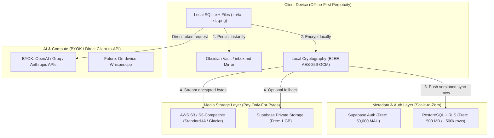

# Anti-Shutdown Architecture & Low-Cost Infrastructure Model

> **Issue**: #268  
> **Branch**: `docs/268-anti-shutdown-low-cost-infra`  
> **Status**: Architecture & Sustainability Plan  
> **Author Commitment**: No-Sale & Anti-Shutdown Lifetime Covenant

---

## 1. Context: Why Capture Apps Die and The Core Commitment

### 1.1 The SaaS Graveyard Cycle
Over the last decade, countless voice and note-capture applications (Evernote, Coda, Otter, AudioPen, Rewind, Artifact, etc.) have followed an identical lifecycle:
1. **VC funding / Free tier honeymoon**: Free or heavily subsidized sync and AI processing attract thousands of users.
2. **Fixed infrastructure overhead balloons**: Central relational databases, 24/7 virtual machines, and unmetered cloud storage create recurring monthly bills of thousands of dollars.
3. **Monetization panic**: The service introduces steep monthly subscriptions ($15–$30/mo) or paywalls previously free features.
4. **Acquisition or Sudden Sunset**: If growth slows, the startup is acqui-hired or shuts down abruptly. Users receive an email giving them 30 days (or less) to salvage their data from proprietary formats.

### 1.2 The Creator's Lifetime Covenant
Augustyniak Capture is built on an explicit personal pledge:
* **Never Sold**: The project will never be sold to private equity or an external buyer looking to monetize user lock-in.
* **Never Abruptly Killed**: The application will never execute a surprise shutdown. Even if every remote cloud provider in the world ceases operations, the client application will continue running without loss of local functionality.
* **Data Sovereignty First**: Capture files and metadata belong to the user on their own filesystem first, in standard formats (`.m4a`, `.txt`, `.png`, SQLite, and Markdown).
* **Cost-Pass-Through Transparency**: Cloud synchronization, storage, and authentication costs are engineered to be near-zero and transparent. If central infrastructure is provided, costs are passed through directly at raw provider rates without speculative margins.

---

## 2. The Architectural Strategy: Zero-Fixed-Cost & Scale-to-Zero

To make the anti-shutdown guarantee economically viable forever, the architecture eliminates **all fixed monthly recurring costs** for the maintainer.

### 2.1 Layer 0: The Local Sanctuary (Cost: $0.00/mo)
* **Local filesystem primacy**: Every audio note, text capture, and image is verified on disk before any network request or enrichment is scheduled (see core architectural invariants).
* **Open file formats**: Raw `.m4a` files, UTF-8 `.txt`, standard SQLite database (`app_database.dart`), and direct mirroring to Markdown (`inbox.md`, Obsidian vaults).
* **Zero server dependency**: If the user never configures a backend, the application has full functionality (recording, playing, tagging, vault exports, local searches) with zero server contact.

### 2.2 Layer 1: Bring-Your-Own-Cloud (BYOC) — Zero Maintainer Liability
The safest way to prevent infrastructure shutdown is to never concentrate infrastructure bills into a single centralized account:
* **BYOC Supabase**: The user can supply their own `SUPABASE_URL` and `SUPABASE_PUBLISHABLE_KEY` (or connect their own self-hosted Supabase instance). A personal Supabase project on the Free Tier costs $0/month indefinitely.
* **BYOC AWS S3**: The user can configure an AWS S3 bucket with scoped IAM credentials (or Cloudflare R2 / MinIO) for encrypted audio and media synchronization.
* **BYOK AI Inference**: All transcription (Whisper, Groq) and LLM enrichment (OpenAI, Anthropic, Gemini) are already driven by the user's personal API keys, meaning the maintainer never pays token bills on behalf of users.

### 2.3 Layer 2: Managed Central Cloud (Ultra-Low-Cost Multi-Tenant Topology)
For users who do not want to manage their own AWS or Supabase accounts, a managed tier is supported using a strictly optimized architecture:

#### A. Database & Metadata: Supabase PostgreSQL + RLS + E2EE
* **Multi-tenant isolation**: Enforced via PostgreSQL Row-Level Security (`owner_id = auth.uid()`).
* **Zero-Knowledge Encryption (Issue #245)**: The central database only stores ciphertext envelopes. The server cannot inspect user thoughts, titles, transcripts, or tags.
* **Storage Footprint**: An average capture metadata row takes ~1 KB. 10,000 captures take only ~10 MB of relational storage. A 500 MB database accommodates ~500,000 captures before needing tier expansion.

#### B. Media Blobs: AWS S3 & Tiered Storage
Audio captures (`.m4a` at 64 kbps AAC) take approximately:
* 1 minute = ~480 KB
* 1 hour = ~28.8 MB
* 1,000 captures (average 90s) = ~720 MB

Using AWS S3 Standard + Lifecycle Rules:
* **Storage**: $0.023 / GB / month (AWS S3 Standard), dropping to $0.0125 / GB / month (Standard-IA) for captures older than 30 days.
* **Transfer out**: Free within cloud limits; minimized by local-first caching (audio is only pulled once per device).
* **Cost per user per month (active capture user, 100 recordings/month)**:
  * Storage: ~$0.002 / month.
  * API requests (PUT/GET): ~$0.001 / month.
  * **Total media infrastructure cost per user**: < $0.01 / month (< 5 groszy / miesiąc).

#### C. Authentication & Compute: Serverless Only
* **No persistent EC2/VM instances**: Zero virtual machines running 24/7 idle.
* **Supabase Auth / AWS Cognito**: Free tiers allow up to 50,000 MAU.
* **Serverless Edge Functions / AWS Lambda**: Compute only executes during active sync RPCs (`sync_push`), scaling down to absolute zero between requests.

---

## 3. Financial Sustainability & Cost Coverage Model

To fulfill the user's requirement ("będzie trzeba pokryć koszty związane z utrzymaniem tejże usługi, suba base'a, konta twojego i tak dalej"):

| Model | Target Audience | Maintainer Monthly Cost | User Cost | Shutdown Risk |
|---|---|---|---|---|
| **1. Local-Only** | Privacy-focused, single device | $0.00 | $0.00 | **Zero** |
| **2. BYOC / Self-Hosted** | Tech-savvy, developers | $0.00 | Free tier or $0.01–$0.05/mo on AWS | **Zero** |
| **3. Central Managed (Pass-Through Pool)** | Non-technical users needing cloud sync | $0.00 (endowed by pass-through) | Micro-contribution (~$1–$2/year or tip jar) | **Zero (immune to VC scale trap)** |

### 3.1 Transparent Cost Ledger (In-App & Public)
* The app already maintains a local pricebook in `features/costs/`.
* We will expose a **"Cloud Infrastructure Cost Report"** directly in the Config tab:
  * Shows exact estimated AWS S3 bytes stored and API calls.
  * Shows exact Supabase database bytes occupied.
  * Computes the actual cost to serve the specific account down to fractions of a cent.

### 3.2 "Sustained Endowment" Guarantee
* Central cloud infrastructure is structured with a prepaid 12-month runway reserve.
* If funding ever drops below the maintenance threshold, the system triggers an automated **Graceful Degrade Procedure**:
  1. No data is erased.
  2. Users receive 6 months of automated export notices.
  3. One-click migration transfers cloud sync from the managed project to the user's personal free Supabase or AWS S3 bucket.

---

## 4. Implementation Roadmap

### Phase 1: Documentation & Covenant (Current - #268)
* Publish this architectural blueprint and the Anti-Shutdown Covenant.
* Add an "Anti-Shutdown & Longevity" section to `site/index.html` and the project README.

### Phase 2: Dual Storage Provider Support (AWS S3 + Supabase)
* Enhance `SyncEngine` / `StorageService` to support native S3 endpoints alongside Supabase Storage.
* Allow users to specify custom S3 bucket, region, access key, and secret key directly in Settings (`features/settings/`).

### Phase 3: In-App BYOC (Bring-Your-Own-Cloud) Wizard
* Provide a simple guided screen in Settings for non-technical users to generate and connect their personal free Supabase project.
* Add one-click export of database schema and RLS policies via standard SQL script.

### Phase 4: Self-Hosting Package
* Provide a `docker-compose.yml` bundle containing Supabase / MinIO / local transcription for full on-premises deployment on home servers, NAS, or private VPS ($3/mo).

---

## 5. Verification & Guarantees

1. **Survival Test**: Disconnecting network entirely leaves all playback, text editing, searching, and local markdown exports 100% operational.
2. **Portability Test**: The SQLite database and local media directory can be copied to any machine or operating system without decryption or proprietary extraction tools.
3. **Cost Boundary Test**: A flood of 100,000 inactive accounts incurs $0.00 in compute cost due to scale-to-zero serverless design.
